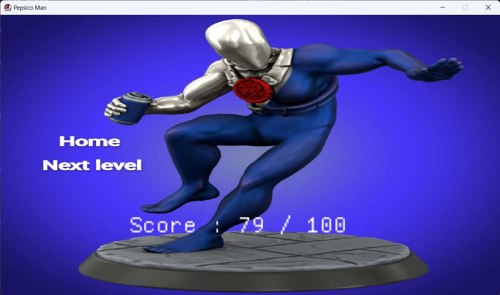
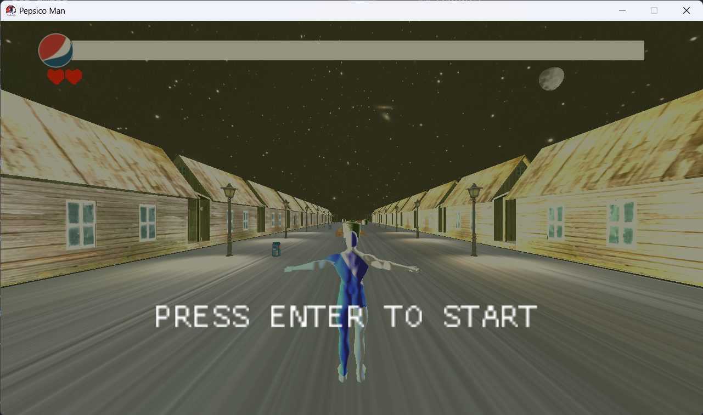
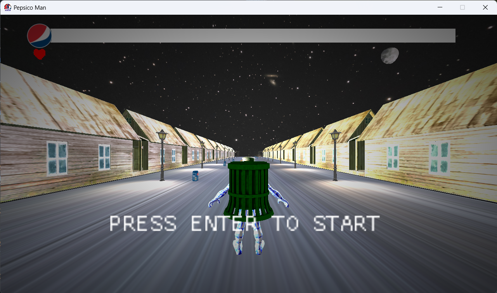

<div align="center">

</div>
<div align="center">
    <h1 align='center'>⚡️<i>Pepsico man</i>⚡️</h1>
    <p> A game Engine </p>
</div>

<div align="center">

[](https://github.com/ImagesAbd-ELrahmanHamza/Pepsico-man/contributors)
[](https://github.com/ImagesAbd-ELrahmanHamza/Pepsico-man/issues)
[](https://github.com/ImagesAbd-ELrahmanHamza/Pepsico-man/blob/master/LICENSE)
[](https://github.com/ImagesAbd-ELrahmanHamza/Pepsico-man/network)
[](https://github.com/ImagesAbd-ELrahmanHamza/Pepsico-man/stargazers)
[](https://img.shields.io/github/languages/count/ImagesAbd-ELrahmanHamza/Pepsico-man)

</div>

<details open="open">
<summary>
<h2 style="display:inline">📝 Table of Contents</h2>
</summary>

- [📑 About](#about)
- [⛏️ Built With](#built-with)
- [📃 Prerequisites ](#Prerequisites)
- [🏁 Getting started](#getting-started)
- [📷 Features](#features)
- [✍️ Contributors](#contributors)
- [🔒 License](#license)

</details>

---

## 📑 About

- Help pepsico man to reach the vending machine and get the pepsi.
- On his way he will face many obstacles.
- He can jump over the obstacles or slide under them.
- He can also collect pepsi cans on his way to get more points.
- The game has 3 levels, each level is harder than the previous one.
- The game has a pause menu, a game over menu and a win menu.
- The game has a background music and sound effects.

## ⛏️ Built with

- C++
- OpenGL
- GLM
- GLFW
- IrrKlang
- ImGui
- stb_image

## 📃 Prerequisites

1. **_CMake_**

   - Download and install [CMake](https://cmake.org/download/).

2. - **_Visual Studio code_**

     - Download and install [Visual Studio code](https://code.visualstudio.com/Download).

   - **_Clion_**

     - Download and install [Clion](https://www.jetbrains.com/clion/download/).

   - or any other IDE you prefer.

3. - **_C++ compiler_**
     - Clang

## 🏁 Getting started

1. **_Clone the repository_**

```sh
$ git clone https://github.com/Abd-ELrahmanHamza/Pepsico-man.git
```

2. **_Navigate to repository directory_**

```sh
$ cd Pepsico-man
```

3. **_Build cmake project_**

4. **_Run the game_**

```sh
  .\bin\GAME_APPLICATION.exe
```

## 📷 Features

https://github.com/Abd-ELrahmanHamza/Pepsico-man/assets/68310502/ac764852-ad6b-4d6b-ab0b-a8ae68401abc

### Main Menu


### levels state


### Winning state



### Losing state


### Level 1 (The easiest level)


### Level 2 (The medium level)



### Level 3 (The hardest level)




## ✍️ Contributors

<table>
  <tr>

<td align="center">
<a href="https://github.com/Abd-ELrahmanHamza" target="_black">
<br /><sub><b>Abdelrahman Hamza</b></sub></a><br />
</td>

<td align="center">
<a href="https://github.com/Ahmedsabry11" target="_black">
<br /><sub><b>Ahmed sabry</b></sub></a><br />
</td>

<td align="center">
<a href="https://github.com/abdelazizSalah" target="_black">
<br /><sub><b>abdelaziz Salah</b></sub></a><br />
</td>

<td align="center">
<a href="https://github.com/ahmedmadbouly186" target="_black">
<br /><sub><b>ahmed madbouly</b></sub></a><br />
</td>
</tr>
</table>

## 🔒 License <a name = "license"></a>

> This software is licensed under MIT License, See [License](./LICENSE) .
